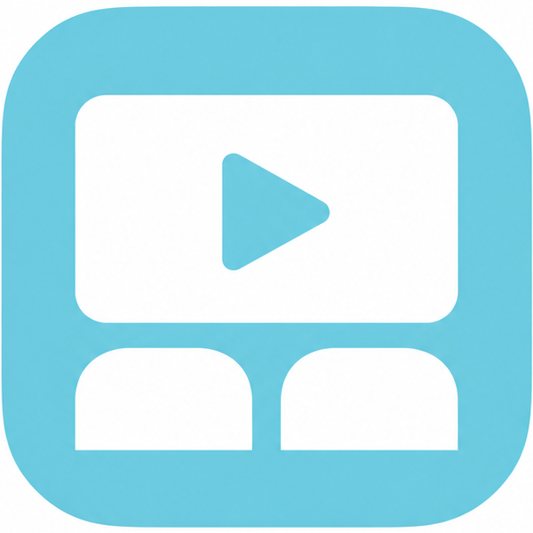

# BiliCinema

BiliCinema 是一款 Windows 桌面应用，基于 [DownKyi Core](https://github.com/crazysmile-PhD/downkyicore)，可以播放哔哩哔哩视频、与好友同步观影，也可以下载影片。每个房间最多 **5 人（1 位房主 + 4 位访客）**。

## 下载

前往 [GitHub Releases](https://github.com/LeonZ03/BiliCinema/releases)，下载最新版本中的 `BiliCinema.exe`，保存到电脑后双击运行。程序以 Windows x64 单文件形式发布，不需要另外安装 .NET。播放视频需要安装 Microsoft Edge WebView2 Runtime；大多数 Windows 电脑已自带该组件。

首次启动需要解压内置组件，请稍候；登录和下载数据默认保存在 `%APPDATA%\DownKyi`。

## 快速开始

1. **登录**：打开“登录”页，用哔哩哔哩 App 扫描页面上的二维码并确认。也可以点“复制二维码图片”，把图片私下发给可信任的协助者扫码。
2. **播放视频**：打开“观影房间”页，粘贴 B 站番剧、电影或普通视频链接。解析完成后即可在视频内操作；不创建房间也可以单人观看。
3. **邀请一起观看**：播放页点击“创建房间”，把同一个邀请链接发给最多 4 位好友。好友运行 BiliCinema 后粘贴链接加入。也可以先创建空房间，等大家加入后再选片。房间通过临时网络隧道连接，房主需要保持程序运行。
4. **同步与聊天**：房主控制选片、选集、播放、暂停、跳转和倍速，所有访客跟随。解析后自动同步实际进度；需要时可点击同步状态右侧的 **↻** 图标：房主发送当前状态，访客重新对齐房主。每个人各自从 B 站播放，画质和音量各自设置。
5. **下载影片**：打开“下载影片”页，解析视频或番剧后选择可用的清晰度、编码和音质，再添加下载任务。页面会显示预计大小；下载功能沿用 DownKyi 的下载器和断点续传能力。

更详细的操作方式、加入房间后的播放行为和同步说明见[观影使用说明](docs/watch-together.md)。

## 观看与聊天

- **F** 进入或退出全屏，**D** 开关弹幕；聊天输入期间暂停播放快捷键。
- 全屏时鼠标移到右边缘呼出聊天，移出面板后收起。新消息在画面右侧显示 5 秒。
- “我的昵称”会记住上次保存的内容，不公开 B 站账号信息。
- 房间最多 **5 人，包含房主**；满员时会提示加入失败。所有成员请使用同一版本。
- 新成员加入或有人缓冲时，会等待在线成员准备好再同步播放。访客断线不阻塞其他人；房主退出程序后，房间服务和临时邀请地址随之关闭。
- 播放权限取决于各自登录的 B 站账号；会员内容需要相应权限。

## 开发者入口

需要构建或维护项目时，可从以下文档开始：

- [架构与模块边界](ARCHITECTURE.md)
- [Agent 修改指南](AGENTS.md)
- [维护文档](docs/maintenance.md)
- [测试说明](docs/testing/README.md)
- [验证与回滚](docs/operations/verification-and-rollback.md)
- [构建脚本](Build-BiliCinema.cmd)

Windows x64 开发电脑可运行 `Build-BiliCinema.cmd` 构建单文件程序；构建需要 .NET 10 SDK。源码也可通过 `dotnet run --project DownKyi/DownKyi.csproj` 运行。

## 项目与许可

DownKyi 默认数据目录为 `%APPDATA%\DownKyi`，可设置 `DOWNKYI_DATA_DIR` 指定其他目录。BiliCinema 基于 DownKyi Core 开发；许可和第三方组件归属见 [LICENSE](LICENSE) 与 [THIRD-PARTY-NOTICES.md](THIRD-PARTY-NOTICES.md)。
